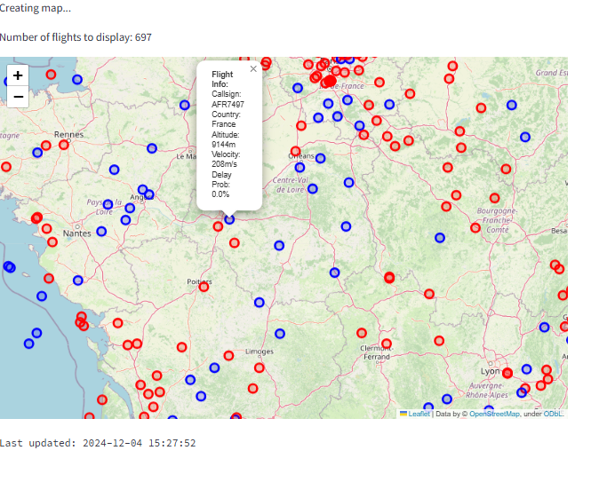
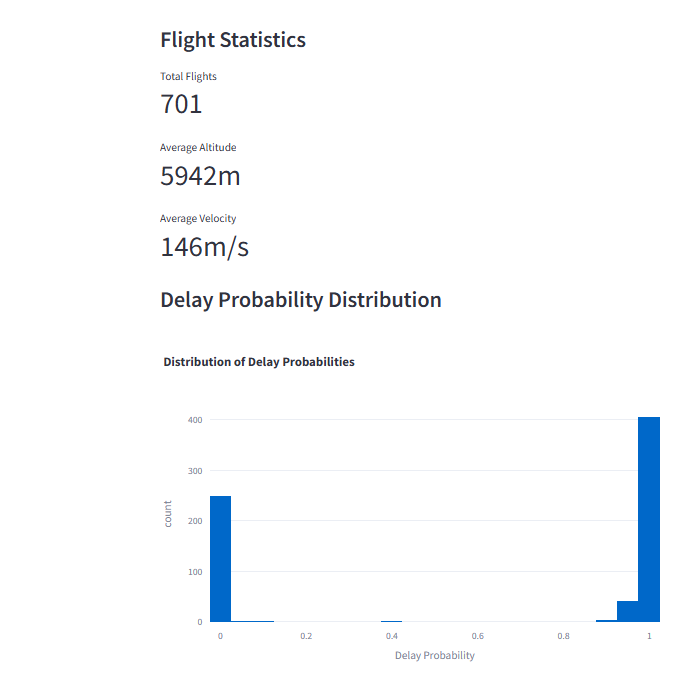

# Real-Time Air Traffic Management System with AI

## 🚀 Project Overview
A sophisticated Python-based web application for real-time air traffic monitoring and analysis, featuring AI-powered delay predictions and advanced analytics. This project demonstrates the integration of real-time data processing, machine learning, and interactive visualization technologies.

## 👨‍💻 Author
**Bechir Mathlouthi**
- GitHub: [Bechir-Mathlouthi](https://github.com/Bechir-Mathlouthi)

## 📸 Screenshots

### Main Interface

*Real-time flight tracking with interactive map*

### Statistics Panel

*Flight statistics and delay predictions*

### Flight Details

*Detailed information for individual flights*

## ✨ Key Features

### 🛩️ Real-Time Flight Tracking
- Live flight data from OpenSky Network API
- Interactive map visualization with dynamic markers
- Multiple view modes (Standard, Heatmap, Satellite)
- Real-time position updates

### 🤖 AI-Powered Analysis
- Machine learning-based delay predictions
- Risk assessment algorithms
- Performance metrics calculation
- Pattern recognition in flight data

### 📊 Advanced Analytics Dashboard
1. **Risk Assessment**
   - Flight risk distribution analysis
   - Risk level categorization
   - Geographical risk heatmaps
   - Country-wise risk analysis

2. **Performance Metrics**
   - Altitude vs. Velocity analysis
   - Flight performance indicators
   - Total distance coverage
   - Speed and altitude distributions

3. **Geographical Analysis**
   - Active countries overview
   - Coverage area calculations
   - Regional distribution analysis
   - Interactive geographical visualizations

4. **Custom Analysis Tools**
   - Multi-parameter correlation analysis
   - Custom metric calculations
   - Statistical summaries
   - Data export capabilities

### 🔍 Search and Filtering
- Advanced flight search functionality
- Multiple filtering criteria
- Customizable data views
- Export capabilities for filtered data

## 🛠️ Technical Stack

### Frontend
- Streamlit for interactive web interface
- Plotly for advanced visualizations
- Folium for map integrations
- Custom CSS for professional styling

### Backend
- Python 3.8+
- SQLite database
- RESTful API integration
- Asynchronous data processing

### AI/ML Components
- Scikit-learn for machine learning
- Random Forest Classifier for predictions
- Real-time data preprocessing
- Model persistence and updates

### Data Sources
- OpenSky Network API
- Historical flight data
- Synthetic training data
- Real-time updates

## 📦 Installation

1. Clone the repository:
```bash
git clone https://github.com/Bechir-Mathlouthi/Real-Time-Air-Traffic-Management-Project-.git
cd Real-Time-Air-Traffic-Management-Project-
```

2. Create and activate virtual environment:
```bash
python -m venv ATM_env
source ATM_env/bin/activate  # On Unix/macOS
.\ATM_env\Scripts\Activate.ps1  # On Windows PowerShell
```

3. Install dependencies:
```bash
pip install -r requirements.txt
```

## ⚙️ Configuration

1. Set up OpenSky Network credentials:
   - Create account at [OpenSky Network](https://opensky-network.org/)
   - Copy `.env.example` to `.env`
   - Add your credentials to `.env`

2. Configure region settings in `.env`:
   ```env
   MIN_LATITUDE=41.0
   MAX_LATITUDE=51.0
   MIN_LONGITUDE=-5.0
   MAX_LONGITUDE=9.0
   ```

## 🚀 Usage

1. Start the application:
```bash
streamlit run src/app.py
```

2. Access the dashboard:
   - Open browser at `http://localhost:8501`
   - Use the sidebar for navigation
   - Explore different analysis views

## 📊 Features in Detail

### Real-Time Monitoring
- Live flight tracking with position updates
- Dynamic risk assessment
- Performance metrics calculation
- Automatic data refresh

### Interactive Analytics
- Custom parameter analysis
- Multi-dimensional visualizations
- Statistical summaries
- Data export options

### Risk Assessment
- Flight risk categorization
- Geographical risk distribution
- Historical trend analysis
- Predictive analytics

## 🎯 Future Enhancements

- [ ] Machine learning model improvements
- [ ] Additional data sources integration
- [ ] Enhanced prediction capabilities
- [ ] More visualization options
- [ ] User authentication system
- [ ] Historical data analysis
- [ ] API endpoint documentation
- [ ] Performance optimizations

## 🤝 Contributing

Contributions are welcome! Please feel free to submit issues and pull requests.

1. Fork the repository
2. Create your feature branch
3. Commit your changes
4. Push to the branch
5. Open a pull request

## 📄 License

This project is licensed under the MIT License - see the [LICENSE](LICENSE) file for details.

## 🙏 Acknowledgments

- OpenSky Network for providing flight data API
- Streamlit team for the amazing framework
- Contributors and supporters of the project

## 📞 Contact

For any questions or suggestions, feel free to reach out:
- GitHub: [Bechir-Mathlouthi](https://github.com/Bechir-Mathlouthi)

---
Copyright © 2024 Bechir Mathlouthi. All rights reserved.
